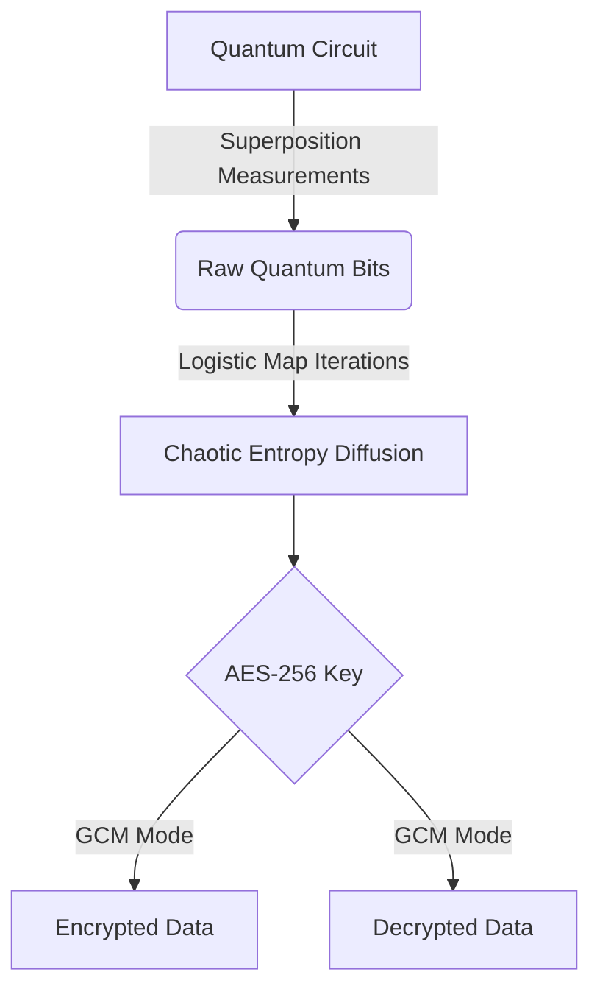

# Quantum-Chaotic Cryptographic Engine 🔐⚛️

[](https://www.python.org/downloads/)
[](https://opensource.org/licenses/Apache-2.0)
[](https://qiskit.org/)
[](https://en.wikipedia.org/wiki/Entropy_(information_theory))

**Next-Generation Cryptography Combining Quantum Randomness and Chaotic Dynamics**


## 📖 Table of Contents
- [Architecture Overview](#-architecture-overview)
- [Key Features](#-key-features)
- [Installation](#-installation)
- [Quick Start](#-quick-start)
- [Advanced Usage](#-advanced-usage)
- [Security Analysis](#-security-analysis)
- [Performance Benchmarks](#-performance-benchmarks)
- [Contributing](#-contributing)
- [License](#-license)
- [Citation](#-citation)

## 🌌 Architecture Overview

### Hybrid Cryptographic Workflow


### Core Components
1. **Quantum Randomness Harvesting**
   - 256-bit entropy generation via IBM Quantum backends
   - Dynamic qubit allocation based on least-busy provider
   - Simulator fallback mode for local development

2. **Chaotic Entropy Diffusion**
   ```math
   x_{n+1} = r \cdot x_n \cdot (1 - x_n)
   ```
   - Logistic map parameterized at `r=4.0` for maximal chaos
   - 100-iteration minimum entropy mixing
   - Degeneracy detection and auto-reinitialization

3. **AES-GCM Cryptography**
   - 256-bit key derivation with NIST-compliant padding
   - Authenticated encryption with associated data (AEAD)
   - Nonce/tag generation compliant with SP 800-38D

## 🚀 Key Features
- **Post-Quantum Ready** - Hybrid approach resistant to Shor's algorithm
- **Chaos-Enhanced Security** - 100+ logistic map iterations prevent pattern analysis
- **Entropy Monitoring** - Real-time Shannon entropy scoring
- **Multi-Platform** - Docker/Python/Pip deployments
- **Zero-Trust Architecture** - Ephemeral key generation per operation

## 📦 Installation

### Option 1: Docker
```bash
docker build -t quantum-chaos-crypto .
docker run -e IBMQ_TOKEN="your_token" quantum-chaos-crypto
```

### Option 2: Python Package
```bash
pip install quantum-chaotic-encryption
```

### Option 3: Manual Setup
```bash
git clone https://github.com/yourusername/quantum-chaotic-encryption.git
cd quantum-chaotic-encryption
python -m venv qc-env
source qc-env/bin/activate
pip install -r
# Quantum-Chaotic Key Generation and AES-GCM Encryption Prototype


## Table of Contents

1. [Project Overview](#project-overview)
2. [Prerequisites](#prerequisites)
3. [Setup](#setup)
4. [Usage](#usage)
5. [Contributing](#contributing)
6. [License](#license)

## Project Overview

This project demonstrates a hybrid cryptographic key generation scheme that combines quantum randomness and chaotic entropy diffusion to create a secure AES-256 key. The generated key is then used to encrypt a message using AES-GCM.

## Prerequisites

- Python 3.8 or later
- IBM Quantum account with API access (see [IBM Quantum documentation](https://quantum-computing.ibm.com/docs/ibmq/quick_start.html#installation) for setup instructions)
- `qiskit` Python library (install using `pip install qiskit`)
- `pycryptodome` Python library (install using `pip install pycryptodome`)

## Setup

1. Clone this repository:
   ```
   git clone https://github.com/quantumapi/quantum-chaotic-encryption.git
   cd quantum-chaotic-encryption
   ```

2. Set your IBM Quantum API token as an environment variable:
   ```
   export IBMQ_TOKEN=your_api_token_here
   ```

## Usage

1. Run the main script to generate a quantum-chaotic key and encrypt a sample message:
   ```
   python quantum_chaotic_encryption.py
   ```

2. The script will output the generated AES-256 key (in hex), the encrypted message details (nonce, ciphertext, and tag in hex), and the decrypted message.

## Contributing

Contributions are welcome! If you encounter any issues or have suggestions for improvement, please submit an issue or pull request.

## License

This project is licensed under the Apache License 2.0 - see the [LICENSE](LICENSE) file for details.
